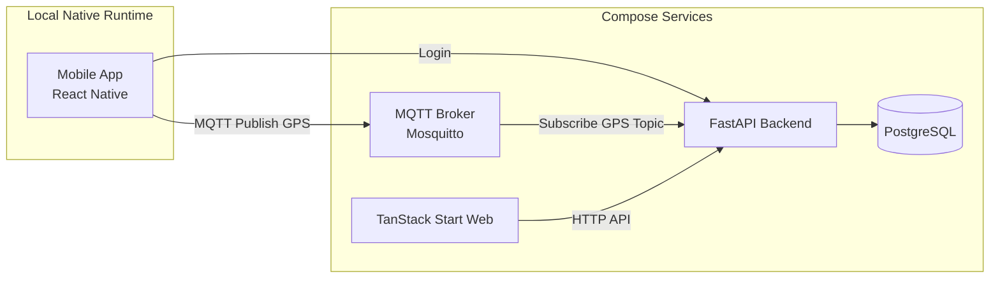
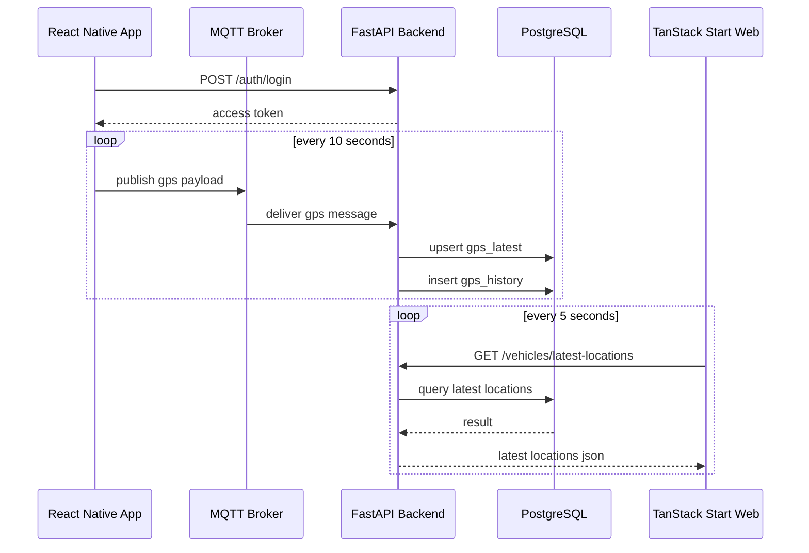
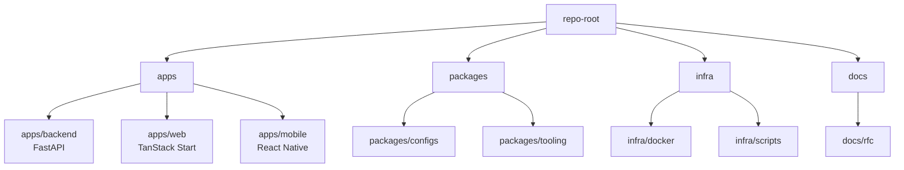
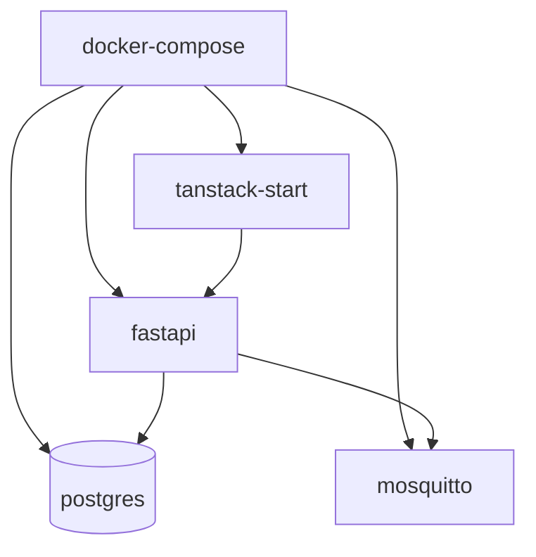

# RFC: General-Purpose Real-Time GPS Vehicle Location Platform MVP

**Status**: Draft
**Target**: Agent Implementation RFC
**Primary Goal**: Build a runnable, demoable, and incrementally extensible MVP for a real-time GPS vehicle location platform
**Last Updated**: 2026-05-19

---

## 1. Background and Problem Definition

If the product is defined too early as a complete coach bus or tour bus fleet management system, the system can become locked into one industry's operating workflow too soon. This would likely cause:

* an overly heavy data model
* inflated feature scope
* higher development cost
* limited reuse across other fleet markets
* costly remodels when expanding into rental cars, taxi fleets, logistics, or other scenarios

Therefore, this RFC does not start with a full fleet management system. It focuses first on a more general and technically defensible core capability:

> **Login + basic role authorization + continuous GPS upload from mobile + real-time web monitoring + an evolvable location data pipeline**

The first phase should stabilize this pipeline before deciding how to expand into different fleet markets.

---

## 2. RFC Goals

### 2.1 Primary Goals

This RFC asks the agent to implement an MVP that satisfies the following:

1. Users can log in to the system.
2. The mobile app can upload GPS data every 10 seconds after login.
3. The backend can receive GPS messages through MQTT and write them to PostgreSQL.
4. The web platform can show the latest vehicle locations and online status.
5. Platform-side services should be started through `docker-compose` as much as possible.
6. The architecture should leave room for future Redis adoption and future 5-second or 1-second upload intervals.

### 2.2 Non-Goals

The following are out of scope for the first phase:

* scheduling
* dispatching
* order management
* billing / settlement
* multi-tenant commercial modeling
* complex reporting
* industry-specific operating rules
* large-scale second-level real-time push optimization
* Redis implementation, except for preserving an extension path

---

## 3. Core Product Definition

The first-phase product definition is:

> **General-purpose real-time vehicle location and monitoring platform MVP**

It is not a full fleet ERP, and it is not a customized system for one vehicle category.

It should first prove that:

* GPS location data can be uploaded reliably.
* The backend data pipeline is clear and can keep running.
* The web client can show the latest location and online status.
* The system architecture can evolve smoothly toward higher traffic scenarios.

---

## 4. Technical Decisions

### 4.1 Retained Decisions

* **Monorepo**: yes
* **Web**: TanStack Start + TanStack Router + signal-kernel / async-runtime, TypeScript
* **Mobile**: React Native, latest stable version, TypeScript
* **Database**: PostgreSQL
* **GPS message transport**: MQTT
* **Container orchestration for local development / demo**: docker-compose

### 4.2 Changed Decisions

* **Backend**: change from NestJS to **Python FastAPI**
* **Web**: change from Next.js to **TanStack Start**

### 4.3 Recommended Backend Implementation Stack

The FastAPI backend should use:

* FastAPI
* SQLAlchemy 2.x
* Alembic
* Pydantic v2
* asyncpg
* Uvicorn
* Python 3.12+
* MQTT client: choose one package such as `gmqtt` or `asyncio-mqtt`

### 4.4 Backend Runtime Principles

During the MVP phase, the backend may handle both of the following in the same FastAPI process:

* HTTP API
* MQTT subscriber

The following restrictions apply:

* local / demo environments should run with **a single Uvicorn worker**
* the MQTT subscriber should be attached through FastAPI lifespan or an equivalent startup flow
* multiple workers must not create multiple subscribers that consume the same topic and duplicate writes
* if horizontal scaling is needed later, GPS ingestion must first be split into an independent worker module and the deployment topology must be revised

Reasons:

* the first version should prioritize completing the location data pipeline, not splitting processes too early
* multiple workers could cause the same MQTT message to be written by multiple backend instances
* the design still leaves room to scale ingestion independently later

### 4.5 Docker Compose Principles

The following services must be startable through `docker-compose`:

* backend, FastAPI
* web, TanStack Start
* postgres
* MQTT broker, Mosquitto

### 4.6 Mobile App Containerization

The React Native mobile app is **not required** to run inside docker-compose.

Reasons:

* real-device and simulator development depends on the local native environment
* Metro, Android, and iOS toolchains are not a good fit for the MVP docker-compose core

Therefore:

* platform-side services, backend / web / db / mqtt, are managed by docker-compose
* the mobile app runs locally, but must connect to the backend and MQTT environment started by compose

### 4.7 Web Runtime Principles

TanStack Start is responsible only for the web app shell, routing, auth guards, and UI rendering.

During the MVP phase:

* FastAPI is the only business backend
* the web client calls FastAPI through HTTP and does not connect directly to PostgreSQL or MQTT
* the web client uses `signal-kernel / async-runtime` to manage latest location polling, cancellation, stale / fresh / error state, and refresh lifecycle
* TanStack Query is a valid alternative for production team standardization, but it is not the primary runtime for this MVP
* TanStack Start Server Components are not required for the first version
* TanStack Start server functions must not handle core business mutations
* sensitive values such as JWT secrets and MQTT credentials must not be placed in the web runtime

Reasons:

* reduce coupling between the web framework and the core business pipeline
* prevent web runtime changes from affecting GPS ingestion and query interfaces
* use the monitoring page as a real-world surface for `signal-kernel / async-runtime`, demonstrating async lifecycle, polling, cancellation, and stale state control
* avoid the Next.js App Router / RSC attack surface without turning TanStack Start into a second backend

---

## 5. MVP Functional Scope

### 5.1 Auth

Required:

* account login
* JWT access token
* basic role field

Initial roles:

* `admin`
* `operator`
* `driver`

### 5.2 Vehicle / Device Basic Relationship

Required:

* a user can log in
* a driver can be bound to a vehicle
* one mobile app instance is treated as one uploading device
* vehicles and users have a basic relationship model

### 5.3 GPS Ingestion

Required:

* the mobile app sends one GPS payload every 10 seconds
* the payload is sent through MQTT
* the backend subscribes to and processes GPS payloads
* the backend validates consistency across topic, payload, and device binding
* the backend writes to `gps_latest` and `gps_history`

### 5.4 Web Monitoring

Required:

* show a vehicle list
* show latest vehicle locations
* show vehicle online / offline status
* allow selecting a vehicle to view its latest upload time and location

### 5.5 Dockerized Local Environment

Required:

* one `docker-compose.yml` can start backend / web / postgres / mqtt
* README documents how the local mobile app connects to the compose environment

---

## 6. Upload Frequency and Evolution Strategy

The first MVP phase uses a conservative strategy:

> **The mobile app uploads GPS once every 10 seconds**

Reasons:

* acceptable for demos and MVP validation
* lets the team validate pipeline stability first
* reduces the initial cost of high-frequency writes and concurrency optimization
* better suited for proving feasibility first

Future evolution may move to:

* once every 5 seconds
* once every 1 second

However, the first version **does not require high-frequency optimization**. It only requires that:

* the architecture and data model do not block future upgrades

---

## 7. System Architecture



### 7.1 MVP Realtime Strategy

To avoid overcomplicating the first version, web monitoring should use:

* **HTTP polling** to fetch latest location data

Recommended polling interval:

* vehicle list / latest location: every 5 seconds

Notes:

* since mobile uploads every 10 seconds, 5-second web polling is enough to demonstrate a real-time feel
* WebSocket / SSE are not required in the first version
* if WebSocket / SSE are introduced later, they should first act as invalidation signals, not as the client-side state truth source
* future push events should trigger HTTP snapshot refetches to avoid state drift from missed events, reconnects, or event ordering issues
* after Redis is introduced later, the system can evolve toward higher-frequency push updates or an invalidation bridge

---

## 8. Location Data Flow



---

## 9. Monorepo Structure



### 9.1 Recommended Actual Directory Layout

```text
repo-root/
  apps/
    backend/
      app/
      alembic/
      tests/
      Dockerfile
      pyproject.toml
    web/
      src/
      src/routes/
      src/components/
      src/lib/
      vite.config.ts
      Dockerfile
      package.json
    mobile/
      src/
      android/
      ios/
      package.json
  packages/
    configs/
    tooling/
  infra/
    docker/
      mosquitto/
        mosquitto.conf
      postgres/
        init.sql
    scripts/
  docs/
    rfc/
      gps-platform-mvp.md
  docker-compose.yml
  .env.example
  README.md
```

### 9.2 Cross-Language Contract

Because the backend is Python and the web / mobile clients are TypeScript, this RFC does not require a complex shared type package at the start.

The first version uses the following principles:

* **FastAPI OpenAPI schema is the API source of truth**
* web / mobile initially use minimal handwritten clients
* once contracts stabilize, generated TypeScript types / clients from OpenAPI can be introduced

---

## 10. Docker Compose Design

### 10.1 Required Services

`docker-compose.yml` must include at least:

* `postgres`
* `mqtt`
* `backend`
* `web`

### 10.2 Recommended Compose Architecture



### 10.3 Recommended Service Responsibilities

#### postgres

* store users, vehicles, device bindings, latest locations, and historical locations

#### mqtt

* receive GPS messages uploaded from the mobile app
* recommended broker: `eclipse-mosquitto`
* MVP local / demo can use a controlled internal network and simplified username/password settings
* a public unauthenticated MQTT broker must not be treated as an acceptable production shape

#### backend

* provide auth / vehicles / GPS query interfaces
* subscribe to MQTT topics
* write to PostgreSQL
* validate that MQTT payloads map to active device bindings

#### web

* provide the logged-in monitoring UI
* periodically fetch latest locations from the backend
* use TanStack Router for routing
* use `signal-kernel / async-runtime` for 5-second polling, request cancellation, stale / fresh / error state, and refresh lifecycle

### 10.4 Redis

This RFC does not require Redis in the first compose setup.

However, the architecture and README should preserve a future path for:

* latest location cache
* batch write buffer
* traffic smoothing

---

## 11. Data Model

### 11.1 users

| field         | type        | note                  |
| ------------- | ----------- | --------------------- |
| id            | uuid        | PK                    |
| account       | varchar     | unique                |
| password_hash | varchar     | bcrypt / argon2       |
| role          | varchar     | admin/operator/driver |
| status        | varchar     | active/inactive       |
| created_at    | timestamptz |                       |
| updated_at    | timestamptz |                       |

### 11.2 vehicles

| field        | type        | note            |
| ------------ | ----------- | --------------- |
| id           | uuid        | PK              |
| plate_number | varchar     | unique          |
| name         | varchar     | optional        |
| status       | varchar     | active/inactive |
| created_at   | timestamptz |                 |
| updated_at   | timestamptz |                 |

### 11.3 device_bindings

| field             | type        | note                   |
| ----------------- | ----------- | ---------------------- |
| id                | uuid        | PK                     |
| user_id           | uuid        | FK users.id            |
| vehicle_id        | uuid        | FK vehicles.id         |
| device_identifier | varchar     | device/app instance id |
| status            | varchar     | active/inactive        |
| last_seen_at      | timestamptz |                        |
| created_at        | timestamptz |                        |
| updated_at        | timestamptz |                        |

MVP constraints:

* one `user_id + vehicle_id + device_identifier` can have only one active binding
* the first version assumes that a vehicle has only one active mobile upload device at a time; if dual-device redundancy is needed later, a separate RFC must revise online status and conflict handling

### 11.4 gps_latest

| field       | type             | note                  |
| ----------- | ---------------- | --------------------- |
| vehicle_id  | uuid             | PK / FK vehicles.id   |
| latitude    | double precision | range: -90 to 90      |
| longitude   | double precision | range: -180 to 180    |
| speed       | double precision | nullable, >= 0        |
| heading     | double precision | nullable, 0-360       |
| recorded_at | timestamptz      | device timestamp      |
| updated_at  | timestamptz      | server timestamp      |

### 11.5 gps_history

| field       | type             | note                  |
| ----------- | ---------------- | --------------------- |
| id          | uuid             | PK                    |
| vehicle_id  | uuid             | FK vehicles.id        |
| latitude    | double precision | range: -90 to 90      |
| longitude   | double precision | range: -180 to 180    |
| speed       | double precision | nullable, >= 0        |
| heading     | double precision | nullable, 0-360       |
| recorded_at | timestamptz      | device timestamp      |
| source      | varchar          | mqtt/mobile           |
| created_at  | timestamptz      | server timestamp      |

MVP indexes:

* `gps_history(vehicle_id, recorded_at desc)`: supports per-vehicle route history queries
* `gps_latest(vehicle_id)`: provided by the primary key
* `device_bindings(user_id, vehicle_id, device_identifier, status)`: supports MQTT payload validation

---

## 12. API Design

### 12.1 Auth

#### `POST /auth/login`

Request:

```json
{
  "account": "driver001",
  "password": "secret"
}
```

Response:

```json
{
  "access_token": "jwt-token",
  "token_type": "bearer",
  "user": {
    "id": "uuid",
    "account": "driver001",
    "role": "driver"
  }
}
```

---

### 12.2 Vehicles

#### `GET /vehicles`

Purpose: fetch the vehicle list.

#### `GET /vehicles/latest-locations`

Purpose: fetch latest locations for all vehicles, used by the web monitoring page.

Response example:

```json
[
  {
    "vehicle_id": "uuid",
    "plate_number": "ABC-1234",
    "status": "online",
    "latitude": 25.033,
    "longitude": 121.5654,
    "recorded_at": "2026-05-19T10:00:00Z"
  }
]
```

#### `GET /vehicles/{vehicle_id}/history?from=...&to=...`

Purpose: fetch the historical route for one vehicle.

---

### 12.3 Device Binding

#### `GET /me/device-binding`

Purpose: allow the mobile app to fetch the currently bound vehicle.

---

## 13. MQTT Topic and Payload Design

### 13.1 Topic

MVP uses a fixed topic pattern:

```text
gps/{vehicle_id}
```

Example:

```text
gps/4d1d5e3a-xxxx-xxxx-xxxx-123456789abc
```

### 13.2 Payload

```json
{
  "vehicle_id": "uuid",
  "user_id": "uuid",
  "device_identifier": "device-001",
  "latitude": 25.033,
  "longitude": 121.5654,
  "speed": 42.5,
  "heading": 180,
  "recorded_at": "2026-05-19T10:00:00Z"
}
```

### 13.3 Backend MQTT Behavior

The backend must:

1. subscribe to `gps/+`
2. parse `vehicle_id` from the topic
3. validate required payload fields
4. verify that the topic `vehicle_id` equals the payload `vehicle_id`
5. verify that `user_id + vehicle_id + device_identifier` maps to an active `device_bindings` record
6. validate latitude, longitude, speed, and heading ranges
7. write to `gps_history`
8. upsert `gps_latest`
9. update `device_bindings.last_seen_at`

### 13.4 MQTT Auth MVP Principles

The first version uses a demo-safe minimal MQTT authentication strategy:

* local / demo broker is not exposed to the public internet
* broker uses username/password or an equivalent mechanism to avoid arbitrary anonymous publish
* mobile app can obtain MQTT connection settings through `.env` or after login
* backend must still perform application-layer validation through `device_bindings`; broker connection success alone must not be trusted

Non-goals:

* per-device MQTT credential rotation is not required in the first version
* automatic broker ACL synchronization is not required in the first version
* mTLS is not required in the first version

Before productionization, per-device credentials or broker ACLs must be added to prevent a device from publishing to a topic for an unbound vehicle.

---

## 14. Online / Offline Rule

The MVP uses a simple rule:

* if `last_seen_at` is **less than or equal to 30 seconds** from now, the vehicle is `online`
* if it is more than 30 seconds, the vehicle is `offline`

Notes:

* because mobile uploads every 10 seconds, a 30-second threshold is enough to tolerate short jitter

---

## 15. Mobile App Requirements

### 15.1 Required

* React Native + TypeScript
* login page
* location permission request
* start GPS upload
* fetch location every 10 seconds
* send payload through MQTT

### 15.2 Optional but Valuable

* show currently bound vehicle
* show current upload status
* show latest upload time
* simple failure retry

### 15.3 Not Required by This RFC

* full background service optimization
* all iOS / Android edge-case handling
* complex offline queue mechanism

### 15.4 Mobile Environment Integration

The mobile app must support `.env` configuration for:

* `API_BASE_URL`
* `MQTT_HOST`
* `MQTT_PORT`

---

## 16. Web Monitoring Requirements

### 16.1 Required

* TanStack Start + TanStack Router + signal-kernel / async-runtime + TypeScript
* login page
* monitoring home page
* vehicle list
* latest location information
* online / offline display
* 5-second polling for the latest location interface
* protected monitoring route that redirects unauthenticated users to login

### 16.2 Can Be Deferred

* polished map route playback UI
* WebSocket
* SSE
* real-time push
* TanStack Start Server Components
* business mutations handled by the web runtime

### 16.3 Acceptable Alternative

TanStack Query is a reasonable choice for server state and polling in typical team products. If future team standardization requires it, the project may revisit TanStack Query. For this MVP, the primary approach intentionally uses `signal-kernel / async-runtime` so the monitoring page can demonstrate explicit control over async lifecycle, polling, cancellation, stale / fresh / error state, and future push-to-refetch behavior.

---

## 17. Agent Implementation Task Breakdown

The following task order is a **strongly recommended sequence**. Implementation should use vertical tracer bullets: every phase should produce a small, startable, testable, demoable end-to-end capability, instead of first creating all file scaffolding and adding behavior only at the end.

---

### Phase 0: Repository Scaffold

#### Goal

Create the basic monorepo structure and docker-compose skeleton.

#### Tasks

* create `apps/backend`
* create `apps/web`
* create `apps/mobile`
* create `infra/docker`
* create root `docker-compose.yml`
* create `.env.example`
* create README startup instructions

#### Acceptance Criteria

* repo structure exists
* `docker compose up --build` can start postgres / mqtt / backend / web

---

### Phase 1: FastAPI Backend Foundation

#### Goal

Complete the backend foundation for login, queries, and migrations.

#### Tasks

* FastAPI app scaffold
* SQLAlchemy models
* Alembic migration
* JWT auth
* users / vehicles seed data
* device binding seed data
* `/auth/login`
* `/vehicles`
* `/vehicles/latest-locations`
* `/vehicles/{vehicle_id}/history`

#### Acceptance Criteria

* API docs are available at `/docs`
* DB migration can run
* login returns a token
* querying latest locations returns an empty result when there is no GPS data
* the seed driver can fetch their active device binding

---

### Phase 2: MQTT Ingestion

#### Goal

Connect GPS messages from backend ingestion to database writes.

#### Tasks

* start MQTT broker
* backend subscribes to `gps/+`
* validate consistency across topic / payload / active device binding
* insert `gps_history`
* upsert `gps_latest`
* update `device_bindings.last_seen_at`

#### Acceptance Criteria

* after manually publishing an MQTT test message, latest location and history data are visible in DB
* `GET /vehicles/latest-locations` returns data
* if topic and payload vehicle IDs do not match, the message is rejected and nothing is written to DB
* if device binding does not exist or is inactive, the message is rejected and nothing is written to DB

---

### Phase 3: TanStack Start Monitoring Web

#### Goal

Build the minimal monitoring platform.

#### Tasks

* TanStack Start app scaffold
* TanStack Router route setup
* login page
* access token storage
* protected monitoring route
* minimal FastAPI client
* 5-second `signal-kernel / async-runtime` polling of `/vehicles/latest-locations`
* request cancellation, stale / fresh / error state, and manual refresh lifecycle
* show online / offline status
* allow viewing one vehicle's latest location and time

#### Acceptance Criteria

* user can log in through the web
* location data refreshes through polling
* unauthenticated users cannot enter the monitoring page

---

### Phase 4: React Native Mobile App

#### Goal

Build the GPS upload client.

#### Tasks

* login page
* configure API / MQTT host
* request location permission
* read location every 10 seconds
* publish to `gps/{vehicle_id}`
* show current upload status

#### Acceptance Criteria

* mobile app can log in
* mobile app can continuously send GPS messages
* backend can receive and write the data
* web can show changing locations

---

### Phase 5: Integration / Demo Hardening

#### Goal

Complete a demoable MVP.

#### Tasks

* complete README
* complete `.env.example`
* add basic error handling
* organize startup scripts
* add test accounts and test vehicles
* verify the demo flow

#### Acceptance Criteria

* a new team member can start the system by following README
* mobile, backend, web, mqtt, and postgres all work through the full pipeline

---

## 18. Acceptance Criteria

The minimum completion criteria for this RFC are:

1. `docker compose up --build` can start platform-side services.
2. backend supports login and query interfaces.
3. MQTT messages can be consumed by the backend.
4. GPS payloads are correctly written to `gps_history` and `gps_latest`.
5. web can show latest vehicle locations.
6. mobile can upload GPS every 10 seconds.
7. online / offline rules work correctly.

---

## 19. Redis Extension Design, Reserved Only

If vehicle count and upload frequency increase later, Redis is expected to be introduced for:

* latest location cache
* write buffer
* batch flush queue
* future pub/sub bridge

However, the first-version agent **must not proactively implement Redis** unless the MVP is complete and a separate RFC is opened.

---

## 20. Implementation Restrictions

During implementation, the agent must follow these restrictions:

1. **Do not add excessive abstraction**. Prioritize a runnable MVP first.
2. **Do not introduce multi-tenancy / dispatching / reporting too early**.
3. **Do not treat WebSocket / SSE as first-version requirements**.
4. **Do not make mobile app containerization required work**.
5. **Do not introduce Redis at the beginning**.
6. **Do not delay the core pipeline for an ideal architecture**.
7. **Do not use TanStack Start server functions as the core business backend**.

---

## 21. One-Sentence Summary

> Use FastAPI + TanStack Start + React Native + PostgreSQL + MQTT, start platform-side services through docker-compose, complete a general-purpose location platform MVP that uploads GPS every 10 seconds and shows real-time vehicle locations on the web, while preserving an evolution path for Redis and higher-frequency location updates.
