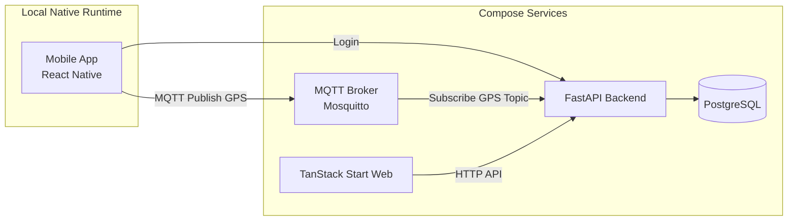
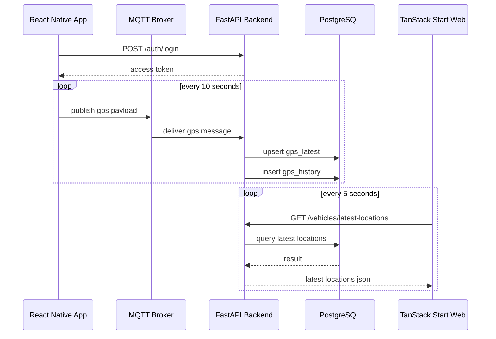
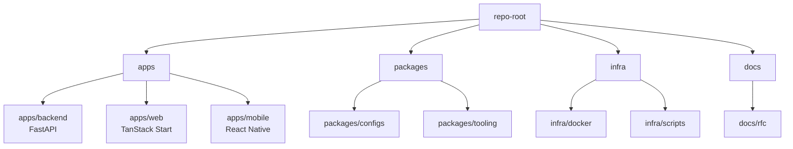
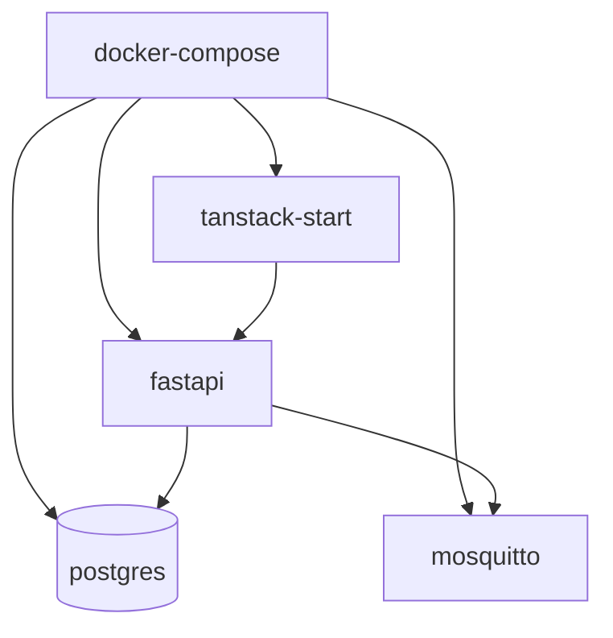

# RFC: 通用型即時 GPS 車輛定位平台 MVP

**Status**: Draft
**Target**: Agent Implementation RFC
**Primary Goal**: 先完成一套可運行、可展示、可逐步擴展的即時 GPS 定位平台 MVP
**Last Updated**: 2026-05-19

---

## 1. 背景與問題定義

目前若直接把產品定義成「大客車 / 遊覽車完整車隊管理系統」，系統很容易過早被特定產業流程綁死，導致：

* 資料模型過重
* 功能範圍膨脹
* 開發成本高
* 難以複用到其他車隊市場
* 未來切入租賃車、計程車行、物流等場景時，需要重新拆模

因此，本 RFC 的方向不是直接做完整車隊管理，而是先聚焦在一個更通用、也更具技術護城河的核心能力：

> **登入 + 基本角色權限 + Mobile 持續上拋 GPS + Web 即時監控 + 可演進的定位資料鏈路**

第一階段先把這條鏈路做穩，再決定如何向不同車隊市場擴張。

---

## 2. RFC 目標

### 2.1 主要目標

本 RFC 要求 agent 實作一套 MVP，滿足以下條件：

1. 使用者可以登入系統
2. Mobile App 可在登入後每 10 秒上拋一次 GPS 資料
3. Backend 可透過 MQTT 接收 GPS 訊息並寫入 PostgreSQL
4. Web 平台可查看車輛最新位置與在線狀態
5. 所有平台側環境盡量透過 `docker-compose` 啟動
6. 架構需為未來加入 Redis、提升到 5 秒 / 1 秒頻率預留空間

### 2.2 非目標

以下內容不在本 RFC 第一階段範圍內：

* 排班系統
* 派車調度
* 訂單管理
* 收費 / 結算
* 多租戶商業模型
* 複雜報表
* 各產業專屬營運規則
* 秒級大規模即時推播優化
* Redis 實作（僅保留擴充設計）

---

## 3. 核心產品定義

本專案第一階段的產品定義如下：

> **通用型即時車輛定位與監控平台 MVP**

它不是完整車隊 ERP，也不是針對特定車種的客製管理系統。

它要先證明的是：

* GPS 定位資料可穩定上拋
* 後端資料鏈路清楚且可持續運作
* Web 端可查看最新位置與在線狀態
* 系統架構能平順演進到更高流量場景

---

## 4. 技術決策

### 4.1 保留決策

* **Monorepo**：是
* **Web**：TanStack Start + TanStack Router + signal-kernel / async-runtime（TypeScript）
* **Mobile**：React Native（最新穩定版，TypeScript）
* **Database**：PostgreSQL
* **GPS 訊息傳輸**：MQTT
* **Container Orchestration（Local Dev / Demo）**：docker-compose

### 4.2 調整決策

* **Backend**：由 NestJS 改為 **Python FastAPI**
* **Web**：由 Next.js 改為 **TanStack Start**

### 4.3 Backend 建議實作細節

FastAPI 端建議採以下組合：

* FastAPI
* SQLAlchemy 2.x
* Alembic
* Pydantic v2
* asyncpg
* Uvicorn
* Python 3.12+
* MQTT client：`gmqtt` 或 `asyncio-mqtt` 類型套件，擇一即可

### 4.4 Backend Runtime 原則

MVP 階段允許 backend 在同一個 FastAPI process 內同時承擔：

* HTTP API
* MQTT subscriber

但需遵守以下限制：

* local / demo 環境先以 **單一 Uvicorn worker** 執行
* MQTT subscriber 透過 FastAPI lifespan 或等價啟動流程掛載
* 不得在多 worker 設定下讓多個 subscriber 重複消費同一 topic
* 若未來需要水平擴展，需先將 GPS ingestion 拆成獨立 worker module，再另行調整部署拓撲

理由：

* 第一版優先打通定位資料鏈路，不提早拆出過多 process
* 避免多 worker 導致同一筆 MQTT message 被多個 backend instance 重複寫入
* 保留未來將 ingestion 獨立擴展的空間

### 4.5 Docker Compose 原則

以下服務必須能透過 `docker-compose` 啟動：

* backend（FastAPI）
* web（TanStack Start）
* postgres
* mqtt broker（Mosquitto）

### 4.6 關於 Mobile App 容器化

React Native 手機 App **不要求**放進 docker-compose 內執行。

理由：

* 真機 / 模擬器開發依賴本機原生環境
* Metro、Android/iOS toolchain 不適合當作 MVP 的 docker-compose 主軸

因此本 RFC 的要求是：

* 平台端（backend / web / db / mqtt）以 docker-compose 管理
* mobile app 保持本機啟動，但必須能對接 compose 啟動後的 backend / mqtt 環境

### 4.7 Web Runtime 原則

TanStack Start 只負責 Web app shell、routing、auth guard 與 UI rendering。

MVP 階段需遵守：

* FastAPI 是唯一業務 backend
* Web 端透過 HTTP 呼叫 FastAPI，不直接連 PostgreSQL 或 MQTT
* Web 端使用 `signal-kernel / async-runtime` 管理 latest location polling、cancellation、stale / fresh / error state 與 refresh lifecycle
* TanStack Query 是 production team standardization 的合理替代方案，但不是本 MVP 主方案
* 不使用 TanStack Start Server Components 作為第一版必要能力
* 不使用 TanStack Start server functions 承擔核心業務 mutation
* JWT secret、MQTT credential 等敏感資訊不得放進 web runtime

理由：

* 降低 Web framework 對核心業務鏈路的耦合
* 避免因 Web runtime 變動而影響 GPS ingestion 與查詢 API
* 讓監控頁成為 `signal-kernel / async-runtime` 的實際展示面，展示 async lifecycle、polling、cancellation 與 stale state 控制
* 避開 Next.js App Router / RSC 相關攻擊面，同時不把 TanStack Start 當作第二個 backend

---

## 5. MVP 功能範圍

### 5.1 Auth

必做：

* 帳號登入
* JWT access token
* 基本角色欄位
* 登入後依照使用者角色與可見範圍限制資料查詢

角色先定義為：

* `admin`
* `operator`
* `driver`

### 5.2 Vehicle / Device 基礎關聯

必做：

* User 可登入
* Driver 可綁定車輛
* 一支 mobile app 視為一個裝置上拋端
* 車輛與使用者為基本關聯模型
* admin / operator 這類 monitoring user 可透過基礎從屬關係監控 driver
* Web 端只能看到目前 JWT 使用者可見範圍內的註冊使用者、車輛與定位資料

### 5.2.1 User Relationship / Visibility Scope

本 MVP 需要保有基礎用戶從屬關係，但不實作完整多租戶商業模型。

定義：

* `admin`：可監控所有 active users、vehicles、device bindings 與 GPS data
* `operator`：只能監控透過 active relationship 指派給自己的 driver users
* `driver`：只能查看自己與自己的 device binding；GPS 上拋也只能使用自己的 active binding

這個範圍稱為 **visibility scope**。所有 Web monitoring API 必須依目前 JWT user 的 visibility scope 過濾資料。

### 5.3 GPS Ingestion

必做：

* Mobile App 每 10 秒送出一次 GPS payload
* 透過 MQTT 發送
* Backend 訂閱並處理 GPS payload
* Backend 驗證 topic、payload、device binding 的一致性
* 寫入 `gps_latest` 與 `gps_history`

### 5.4 Web Monitoring

必做：

* 顯示車輛列表
* 顯示車輛最新位置
* 顯示車輛在線 / 離線狀態
* 點選車輛查看最近一次上拋時間與位置

### 5.5 Dockerized Local Environment

必做：

* 單一 `docker-compose.yml` 可啟動 backend / web / postgres / mqtt
* README 提供本機 mobile 對接 compose 環境的方式

---

## 6. 上拋頻率與演進策略

MVP 第一階段採保守策略：

> **Mobile App 每 10 秒上拋一次 GPS**

原因：

* 對 Demo 與 MVP 已可接受
* 能先驗證資料鏈路穩定性
* 可降低高頻寫入與併發優化成本
* 更適合先證明可行性

未來可演進至：

* 5 秒一次
* 1 秒一次

但本 RFC **不要求**第一版實作高頻場景優化，只要求：

* 架構與資料模型不要阻礙未來升級

---

## 7. 系統架構



### 7.1 MVP Realtime 策略

為避免第一版過度複雜，Web Monitoring 先採：

* **HTTP Polling** 取得最新位置資料

建議輪詢頻率：

* 車輛列表 / 最新定位：每 5 秒輪詢一次

備註：

* 由於 mobile 每 10 秒上拋一次，Web 先用 5 秒輪詢已足以展示即時感
* WebSocket / SSE 不列入第一版必做範圍
* WebSocket / SSE 若未來導入，應優先作為 invalidation signal，而不是 client-side state truth source
* 未來推播事件只應觸發 HTTP snapshot refetch，避免 event stream 漏接、重連或順序錯亂造成 state drift
* 後續若導入 Redis，可再升級為更高頻推播或 invalidation bridge

---

## 8. 定位資料流



---

## 9. Monorepo 結構



### 9.1 建議實際目錄

```text
repo-root/
  apps/
    backend/
      app/
      alembic/
      tests/
      Dockerfile
      pyproject.toml
    web/
      src/
      src/routes/
      src/components/
      src/lib/
      vite.config.ts
      Dockerfile
      package.json
    mobile/
      src/
      android/
      ios/
      package.json
  packages/
    configs/
    tooling/
  infra/
    docker/
      mosquitto/
        mosquitto.conf
      postgres/
        init.sql
    scripts/
  docs/
    rfc/
      gps-platform-mvp.md
  docker-compose.yml
  .env.example
  README.md
```

### 9.2 關於跨語言 contract

由於 backend 是 Python、web / mobile 是 TypeScript，本 RFC 不要求一開始建立複雜的共用型別套件。

第一版採以下原則：

* **FastAPI OpenAPI schema 為 API source of truth**
* Web / Mobile 先手寫 minimal client
* 若後續穩定，再導入 OpenAPI 產生 TS types / client

---

## 10. Docker Compose 設計

### 10.1 必要服務

`docker-compose.yml` 必須至少包含：

* `postgres`
* `mqtt`
* `backend`
* `web`

### 10.2 建議 Compose 架構圖



### 10.3 建議服務責任

#### postgres

* 儲存使用者、車輛、裝置綁定、最新位置、歷史位置

#### mqtt

* 接收 mobile app 上拋的 GPS 訊息
* broker 建議使用 `eclipse-mosquitto`
* MVP local / demo 可先使用受控內網與簡化帳密設定
* 不得把公開無認證 MQTT broker 視為可接受的 production 形態

#### backend

* 提供 auth / vehicles / gps 查詢 API
* 訂閱 MQTT topic
* 寫入 PostgreSQL
* 驗證 MQTT payload 是否對應 active device binding

#### web

* 提供登入後監控頁面
* 定時向 backend 取最新定位
* 使用 TanStack Router 管理路由
* 使用 `signal-kernel / async-runtime` 管理 5 秒 polling、request cancellation、stale / fresh / error state 與 refresh lifecycle

### 10.4 Redis

本 RFC 不要求第一版 compose 啟動 Redis。

但需在架構與 README 中保留未來可加入的說明：

* latest cache
* batch write buffer
* traffic smoothing

若未來為了高流量 GPS ingestion 導入 Redis，Redis 應放在 MQTT ingestion 與
PostgreSQL 寫入之間：

```text
MQTT broker
  -> backend MQTT subscriber
  -> Redis Stream / queue
  -> ingestion worker
  -> PostgreSQL
```

Redis 應被視為 buffer / stream，而不是自行負責業務排程或 DB 寫入的元件。
系統仍需要獨立 ingestion worker 消費 GPS events，驗證 active driver 與 active
device binding，執行 batch / coalesced writes，寫入 PostgreSQL，並且只在 DB
transaction 成功後 ack message。

MVP 階段 backend 可在 validation 後直接寫入 PostgreSQL。Redis worker path
保留給 post-MVP evolution gate，等 load test 顯示直寫 DB 不足時再導入。

---

## 11. 資料模型

### 11.1 users

| field         | type        | note                  |
| ------------- | ----------- | --------------------- |
| id            | uuid        | PK                    |
| account       | varchar     | unique                |
| password_hash | varchar     | bcrypt / argon2       |
| role          | varchar     | admin/operator/driver |
| status        | varchar     | active/inactive       |
| created_at    | timestamptz |                       |
| updated_at    | timestamptz |                       |

### 11.2 vehicles

| field        | type        | note            |
| ------------ | ----------- | --------------- |
| id           | uuid        | PK              |
| plate_number | varchar     | unique          |
| name         | varchar     | optional        |
| status       | varchar     | active/inactive |
| created_at   | timestamptz |                 |
| updated_at   | timestamptz |                 |

### 11.3 device_bindings

| field             | type        | note                   |
| ----------------- | ----------- | ---------------------- |
| id                | uuid        | PK                     |
| user_id           | uuid        | FK users.id            |
| vehicle_id        | uuid        | FK vehicles.id         |
| device_identifier | varchar     | device/app instance id |
| status            | varchar     | active/inactive        |
| last_seen_at      | timestamptz |                        |
| created_at        | timestamptz |                        |
| updated_at        | timestamptz |                        |

MVP 約束：

* 同一個 `user_id + vehicle_id + device_identifier` 只能有一筆 active binding
* 第一版預設一台車同時間只有一個 active mobile 上拋端；若未來需要雙機備援，需另開 RFC 調整 online 判斷與衝突處理

### 11.4 user_relationships

| field             | type        | note                              |
| ----------------- | ----------- | --------------------------------- |
| id                | uuid        | PK                                |
| parent_user_id    | uuid        | FK users.id, monitoring user      |
| child_user_id     | uuid        | FK users.id, monitored driver     |
| relationship_type | varchar     | monitors                          |
| status            | varchar     | active/inactive                   |
| created_at        | timestamptz |                                   |
| updated_at        | timestamptz |                                   |

MVP 約束：

* `parent_user_id` 必須是 `admin` 或 `operator`
* `child_user_id` 必須是 `driver`
* 同一組 `parent_user_id + child_user_id + relationship_type` 只能有一筆 active relationship
* 這不是完整 tenant model；它只用來定義 Web monitoring 的 visibility scope

### 11.5 gps_latest

| field       | type             | note                  |
| ----------- | ---------------- | --------------------- |
| vehicle_id  | uuid             | PK / FK vehicles.id   |
| latitude    | double precision | range: -90 to 90      |
| longitude   | double precision | range: -180 to 180    |
| speed       | double precision | nullable, >= 0        |
| heading     | double precision | nullable, 0-360       |
| recorded_at | timestamptz      | device timestamp      |
| updated_at  | timestamptz      | server timestamp      |

### 11.6 gps_history

| field       | type             | note                  |
| ----------- | ---------------- | --------------------- |
| id          | uuid             | PK                    |
| vehicle_id  | uuid             | FK vehicles.id        |
| latitude    | double precision | range: -90 to 90      |
| longitude   | double precision | range: -180 to 180    |
| speed       | double precision | nullable, >= 0        |
| heading     | double precision | nullable, 0-360       |
| recorded_at | timestamptz      | device timestamp      |
| source      | varchar          | mqtt/mobile           |
| created_at  | timestamptz      | server timestamp      |

MVP 索引：

* `gps_history(vehicle_id, recorded_at desc)`：支援單車歷史軌跡查詢
* `gps_latest(vehicle_id)`：由 primary key 提供
* `device_bindings(user_id, vehicle_id, device_identifier, status)`：支援 MQTT payload 驗證
* `user_relationships(parent_user_id, child_user_id, status)`：支援 Web monitoring visibility scope 查詢

---

## 12. API 設計

### 12.1 Auth

#### `POST /auth/login`

Request:

```json
{
  "account": "driver001",
  "password": "secret"
}
```

Response:

```json
{
  "access_token": "jwt-token",
  "token_type": "bearer",
  "user": {
    "id": "uuid",
    "account": "driver001",
    "role": "driver"
  }
}
```

---

### 12.2 Vehicles

#### `GET /vehicles`

用途：取得目前 JWT user 可見範圍內的車輛列表。

#### `GET /vehicles/latest-locations`

用途：取得目前 JWT user 可見範圍內的車輛最新位置，供 Web 監控頁使用。

Response example:

```json
[
  {
    "vehicle_id": "uuid",
    "plate_number": "ABC-1234",
    "driver_user_id": "uuid",
    "driver_account": "driver001",
    "online_status": "online",
    "latitude": 25.033,
    "longitude": 121.5654,
    "recorded_at": "2026-05-19T10:00:00Z"
  }
]
```

#### `GET /vehicles/{vehicle_id}/history?from=...&to=...`

用途：取得目前 JWT user 可見範圍內單一車輛的歷史軌跡。

---

### 12.3 Users

#### `GET /users`

用途：取得目前 JWT user 可見範圍內的註冊使用者。

MVP 規則：

* `admin` 可看到所有 active users
* `operator` 可看到 active relationship 指派給自己的 driver users
* `driver` 只能看到自己

---

### 12.4 Device Binding

#### `GET /me/device-binding`

用途：mobile app 取得目前綁定車輛資訊

### 12.5 Visibility Scope 規則

所有 monitoring 查詢都必須從 JWT current user 推導 visibility scope：

```text
admin
  -> all active driver users
  -> their active device_bindings
  -> vehicles
  -> gps_latest / gps_history

operator
  -> active user_relationships where parent_user_id = current_user.id
  -> child driver users
  -> their active device_bindings
  -> vehicles
  -> gps_latest / gps_history

driver
  -> self
  -> own active device_bindings
```

---

## 13. MQTT Topic 與 Payload 設計

### 13.1 Topic

MVP 固定使用：

```text
gps/{vehicle_id}
```

例如：

```text
gps/4d1d5e3a-xxxx-xxxx-xxxx-123456789abc
```

### 13.2 Payload

```json
{
  "vehicle_id": "uuid",
  "user_id": "uuid",
  "device_identifier": "device-001",
  "latitude": 25.033,
  "longitude": 121.5654,
  "speed": 42.5,
  "heading": 180,
  "recorded_at": "2026-05-19T10:00:00Z"
}
```

### 13.3 Backend MQTT 行為

Backend 必須：

1. 訂閱 `gps/+`
2. 從 topic 解析 `vehicle_id`
3. 驗證 payload 基本欄位
4. 驗證 topic 的 `vehicle_id` 必須等於 payload 的 `vehicle_id`
5. 驗證 payload `user_id` 對應 active registered user，且 role 必須是 `driver`
6. 驗證 `user_id + vehicle_id + device_identifier` 對應 active `device_bindings`
7. 驗證經緯度、速度、方向角範圍
8. 寫入 `gps_history`
9. upsert `gps_latest`
10. 更新 `device_bindings.last_seen_at`

### 13.4 MQTT Auth MVP 原則

第一版的 MQTT 認證採 demo-safe 最小策略：

* local / demo broker 不公開到外網
* broker 使用帳密或等價方式避免匿名任意 publish
* mobile app 可透過 `.env` 或登入後設定取得 MQTT 連線資訊
* backend 仍需以 `device_bindings` 做應用層驗證，不得只信任 broker 連線成功

非目標：

* 不要求第一版實作 per-device MQTT credential rotation
* 不要求第一版實作 broker ACL 自動同步
* 不要求第一版實作 mTLS

但未來 production 化前，需補上 per-device credential 或 broker ACL，避免裝置能 publish 到非綁定車輛的 topic。

---

## 14. 在線 / 離線規則

MVP 先使用簡單規則：

* 若 `last_seen_at` 距離現在 **小於等於 30 秒**，視為 `online`
* 超過 30 秒，視為 `offline`

備註：

* 由於 mobile 每 10 秒上拋一次，30 秒門檻足夠容忍短暫抖動

---

## 15. Mobile App 要求

### 15.1 必做

* React Native + TypeScript
* 登入頁
* 定位授權請求
* 開始上拋 GPS
* 每 10 秒取一次位置
* 透過 MQTT 發送 payload

### 15.2 非必做但可加分

* 顯示目前綁定車輛
* 顯示目前上拋狀態
* 顯示最近一次上拋時間
* 簡單的失敗重試

### 15.3 本 RFC 不要求

* 完整背景服務最佳化
* iOS / Android 所有邊界情況最佳實作
* 複雜離線佇列機制

### 15.4 Mobile 對接環境

Mobile app 需能透過 `.env` 指定：

* `API_BASE_URL`
* `MQTT_HOST`
* `MQTT_PORT`

---

## 16. Web Monitoring 要求

### 16.1 必做

* TanStack Start + TanStack Router + signal-kernel / async-runtime + TypeScript
* 登入頁
* 監控主頁
* 顯示目前可見範圍內的註冊使用者
* 車輛列表
* 最新位置資訊
* 在線 / 離線顯示
* 5 秒輪詢最新定位 API
* 受保護的監控路由，未登入使用者需導回登入頁

### 16.2 可延後

* 地圖軌跡回放 UI 精修
* WebSocket
* SSE
* 即時推播
* TanStack Start Server Components
* 由 Web runtime 承擔業務 mutation

### 16.3 可接受替代方案

TanStack Query 是一般團隊產品中管理 server state 與 polling 的合理選擇。若未來團隊標準化需要，可評估改用 TanStack Query；但本 MVP 主方案刻意使用 `signal-kernel / async-runtime`，讓監控頁展示 async lifecycle、polling、cancellation、stale / fresh / error state 與未來 push-to-refetch 的底層控制能力。

---

## 17. Agent 實作任務切分

以下任務切分是 **強制建議順序**。實作時應採 vertical tracer bullet：每個階段都要產生可啟動、可測、可展示的一小段端到端能力，而不是先把所有檔案骨架堆完再一次補行為。

---

### Phase 0：Repository Scaffold

#### 目標

建立 monorepo 基本結構與 docker-compose 骨架。

#### 任務

* 建立 `apps/backend`
* 建立 `apps/web`
* 建立 `apps/mobile`
* 建立 `infra/docker`
* 建立根目錄 `docker-compose.yml`
* 建立 `.env.example`
* 建立 README 啟動說明

#### 驗收標準

* repo 結構完成
* `docker compose up --build` 可啟動 postgres / mqtt / backend / web

---

### Phase 1：FastAPI Backend Foundation

#### 目標

完成可登入、可查詢、可 migration 的後端基礎能力。

#### 任務

* FastAPI app scaffold
* SQLAlchemy models
* Alembic migration
* JWT auth
* users / vehicles / user_relationships seed data
* device binding seed data
* `/auth/login`
* `/users`
* `/vehicles`
* `/vehicles/latest-locations`
* `/vehicles/{vehicle_id}/history`

#### 驗收標準

* API 文件可在 `/docs` 檢視
* DB migration 可執行
* 可登入並取得 token
* operator 只能查到 relationship 指派給自己的 driver users
* admin 可查到所有 seed users
* 可查詢空的最新定位結果
* seed driver 可查到自己的 active device binding

---

### Phase 2：MQTT Ingestion

#### 目標

打通 GPS 訊息進入 backend 與 DB 的鏈路。

#### 任務

* 啟動 MQTT broker
* backend 訂閱 `gps/+`
* 驗證 topic / payload / active device binding 一致性
* 驗證 payload user 是 active registered driver
* insert `gps_history`
* upsert `gps_latest`
* 更新 `device_bindings.last_seen_at`

#### 驗收標準

* 手動 publish MQTT 測試訊息後，DB 中可看到最新位置與歷史資料
* `GET /vehicles/latest-locations` 可回傳資料
* topic 與 payload 車輛不一致時，message 會被拒絕且不寫入 DB
* payload user 不是 active driver 時，message 會被拒絕且不寫入 DB
* device binding 不存在或 inactive 時，message 會被拒絕且不寫入 DB

---

### Phase 3：TanStack Start Monitoring Web

#### 目標

建立最小監控平台。

#### 任務

* TanStack Start app scaffold
* TanStack Router route setup
* 登入頁
* access token 保存
* protected monitoring route
* FastAPI minimal client
* 顯示目前可見範圍內的註冊 users
* `signal-kernel / async-runtime` 5 秒輪詢 `/vehicles/latest-locations`
* request cancellation、stale / fresh / error state 與 manual refresh lifecycle
* 顯示 online / offline 狀態
* 可查看單車最近位置與時間

#### 驗收標準

* 可登入 web
* operator 只能看到 visibility scope 內的 users / vehicles / latest locations
* 能看到位置資料隨輪詢刷新
* 未登入使用者不可進入監控頁

---

### Phase 4：React Native Mobile App

#### 目標

建立 GPS 上拋端。

#### 任務

* 登入頁
* 設定 API / MQTT host
* 取得定位授權
* 每 10 秒讀取一次位置
* publish 到 `gps/{vehicle_id}`
* 顯示目前上拋狀態

#### 驗收標準

* mobile 可登入
* mobile 可持續送出 GPS 訊息
* backend 可接收並寫入資料
* web 可看到位置變化

---

### Phase 5：Integration / Demo Hardening

#### 目標

完成可展示 Demo。

#### 任務

* README 補齊
* `.env.example` 補齊
* 基本錯誤處理
* 啟動腳本整理
* 測試帳號與測試車輛資料
* Demo 流程驗證

#### 驗收標準

* 新成員可照 README 啟動
* mobile、backend、web、mqtt、postgres 全鏈路可運作

---

## 18. 驗收條件

本 RFC 完成的最低標準：

1. `docker compose up --build` 可啟動平台側服務
2. backend 可登入並提供查詢 API
3. MQTT 訊息可被 backend 消費
4. GPS payload 可正確寫入 `gps_history` 與 `gps_latest`
5. web 可看到車輛最新位置
6. mobile 可每 10 秒上拋一次 GPS
7. 在線 / 離線規則正確運作

---

## 19. Redis 擴充設計（僅保留，不實作）

未來若車輛數量與頻率上升，預期加入 Redis 作為：

* latest location cache
* write buffer
* batch flush queue
* future pub/sub bridge

在 ingestion scaling 場景中，Redis 應放在 DB persistence 之前，而不是之後。
預期演進路徑為：

```text
MQTT subscriber
  -> lightweight topic / JSON validation
  -> Redis Stream append
  -> ingestion worker consumer group
  -> active user / binding validation
  -> batch insert `gps_history`
  -> coalesced upsert `gps_latest`
  -> update `device_bindings.last_seen_at`
  -> acknowledge Redis message after DB commit
```

worker 負責 retry、batching、dead-letter handling 與 write coalescing。Redis
負責 buffering、backpressure 與 pending-message tracking；Redis 不取代 worker。

但第一版 agent **不得主動加入 Redis 實作**，除非完成 MVP 後另行開 RFC。

---

## 20. 實作限制

agent 在實作時，需遵守以下限制：

1. **不要偷加過多 abstraction**，先以可運行 MVP 為優先
2. **不要提早做多租戶 / 派車 / 報表**
3. **不要把 WebSocket / SSE 當作第一版必要條件**
4. **不要把 mobile app 容器化當作必要工作**
5. **不要一開始導入 Redis**
6. **不要為了理想架構而延誤核心鏈路落地**
7. **不要把 TanStack Start server functions 當作核心業務 backend**

---

## 21. 一句話摘要

> 先用 FastAPI + TanStack Start + React Native + PostgreSQL + MQTT，透過 docker-compose 建立平台側開發環境，完成一套每 10 秒上拋 GPS、可在 Web 端即時監控位置的通用型定位平台 MVP，再保留未來導入 Redis 與高頻定位優化的演進空間。
